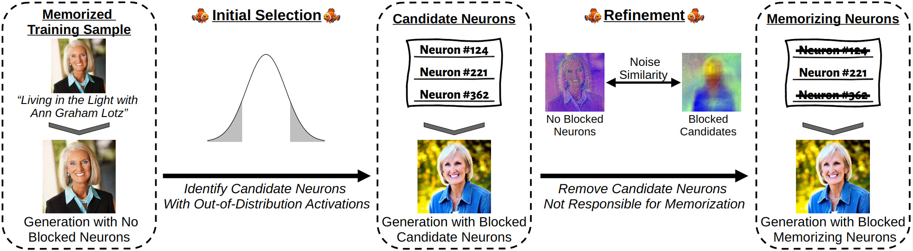
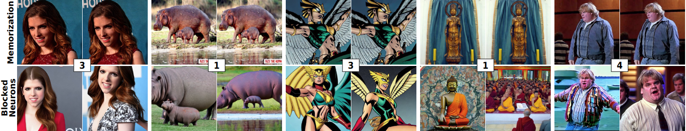

# _Finding NeMo: Localizing Neurons Responsible For Memorization in Diffusion Models_
  <center>
  
  </center>

> **Abstract:**
> *Diffusion models (DMs) produce very detailed and high-quality images. Their power results from extensive training on large amounts of data — usually scraped from the internet without proper attribution or consent from content creators.  Unfortunately, this practice raises privacy and intellectual property concerns, as DMs can memorize and later reproduce their potentially sensitive or copyrighted training images at inference time. Prior efforts prevent this issue by either changing the input to the diffusion process, thereby preventing the DM from generating memorized samples during inference, or removing the memorized data from training altogether. While those are viable solutions when the DM is developed and deployed in a secure and constantly monitored environment, they hold the risk of adversaries circumventing the safeguards and are not effective when the DM itself is publicly released. To solve the problem, we introduce NeMo, the first method to localize memorization of individual data samples down to the level of neurons in DMs' cross-attention layers. Through our experiments, we make the intriguing finding that in many cases, single neurons are responsible for memorizing particular training samples. By deactivating these memorization neurons, we can avoid the replication of training data at inference time, increase the diversity in the generated outputs, and mitigate the leakage of private and copyrighted data. In this way, our NeMo contributes to a more responsible deployment of DMs.*
[Paper (Arxiv)](https://arxiv.org/abs/2406.02366)  
[Paper Page](https://ml-research.github.io/localizing_memorization_in_diffusion_models/)  

# Setup

The easiest way to perform the attacks is to run the code in a Docker container. To build the Docker image, run the following script:
```bash
docker build -t nemo  .
```

To create and start a Docker container, run the following command from the project's root:
```bash
docker run --rm --shm-size 16G --name my_container --gpus '"device=all"' -v $(pwd):/workspace -it nemo bash
```
To add additional GPUs, modify the option ```'"device=0,1,2"'``` accordingly. Detach from the container using ```Ctrl+P``` followed by ```Ctrl+Q```.

# Localizing Memorization
The following steps describe how to apply NeMo to detect memorizing neurons in Stable Diffusion. Each script provides multiple options; run a script with the option -h to get the list of options. Default values correspond to the settings used in the main paper. The first two steps can be skipped since we already provide the required statistics and thresholds.

## 1. Calculating Activation Statistics (Optional)
To identify neurons that memorize specific samples, we must first calculate the activation statistics on unmemorized samples. Use the following script:
```python 
python 1_compute_activations_statistics.py
```
Pre-computed activation statistics for Stable Diffusion v1-4 and 50,000 LAION prompts are provided at ```statistics/statistics_additional_laion_prompts_v1_4.pt```.

## 2. Calculate SSIM Thresholds (Optional)
In addition to activation statistics on unmemorized prompts, we need SSIM thresholds for the neuron detection algorithm. First, calculate the pairwise SSIM between different seeds of unmemorized prompts:
```python
python 2_compute_pairwise_ssim.py
```

Manually calculate the thresholds by loading the file with PyTorch and compute the mean and standard deviation. For the paper, the threshold is set to $0.428$, which corresponds to the mean SSIM score plus one standard deviation. This value is also set as the default in the following detection step.

## 3. Detect Memorization Neurons
To identify memorization neurons, run the following script. Both the initial selection and the refinement process are automatically executed:

```python
python 3_detect_memorized_neurons.py
```

## 4. Image Generation
To calculate metrics, generate the original images (without blocking neurons) and then generate images with the identified neurons blocked. Use the following scripts:

```python
python 4_generate_images.py --original_images -o=generated_images_unblocked
python 4_generate_images.py --refined_neurons -o=generated_images_blocked
```

  <center>
  
  </center>

# Evaluation Metrics

After generating images, compute the metrics by running the scripts in the [metrics](metrics) directory. For all metrics, provide the link to the CSV result file containing the detected neurons. To split the results into VM and TM prompts, also provide a link to the original prompt file with ```-p=prompts/memorized_laion_prompts.csv```

For SSCD-based metrics, download the model via ```wget https://dl.fbaipublicfiles.com/sscd-copy-detection/sscd_disc_mixup.torchscript.pt``` and place it in the project's root folder.

## Memorization
The memorization metrics measure the degree of memorization still present in the generated images. Generate images for each memorized prompt with activated/deactivated memorization neurons and measure the cosine similarities between image pairs using SSCD embeddings to quantify memorization. Additionally, measure the degree of memorization towards the original training images. First, download the original images following the URLs provided in the [prompt file](prompts/memorized_laion_prompts.csv). Ensure the downloaded images are enumerated like ```0001_first_image.jpg``` to match the generated and original images in the script. Higher SSCD scores indicate a higher degree of memorization. Run the following scripts to compute the memorization metrics:

```python
python metrics/compute_sscd_gen.py -p=prompts/memorized_laion_prompts.csv -f=generated_images_blocked -r=generated_images_unblocked
python metrics/compute_sscd_orig.py -p=prompts/memorized_laion_prompts.csv -f=generated_images_blocked -r=original_images
```

## Diversity
The diversity metric assesses the variety of images generated for the same memorized prompt with different seeds. Deactivating memorization neurons increases the diversity of generated images. Compute the diversity metric by running the following script:
```python
python metrics/compute_diversity.py -p=prompts/memorized_laion_prompts.csv -f=generated_images_blocked
```

## Quality
To assess the overall image quality of a DM with activated/deactivated neurons, compute the Fréchet Inception Distance (FID), CLIP-FID, and Kernel Inception Distance (KID) on COCO prompts using the [clean-fid](https://github.com/GaParmar/clean-fid) implementation. This implementation requires two folders: one with the original images and one with the generated images. 

Additionally, compute the similarities between the generated images and the input prompts using CLIP scores to ensure alignment between the generated images and their prompts. Run the following script to compute the prompt alignment:

```python
python metrics/compute_prompt_alignment.py -p=prompts/memorized_laion_prompts.csv -f=generated_images_blocked
```

# Citation
If you build upon our work, please don't forget to cite us.
```
@inproceedings{hintersdorf2024nemo,
    title={Finding NeMo: Localizing Neurons Responsible For Memorization in Diffusion Models},
    author={Dominik Hintersdorf and Lukas Struppek and Kristian Kersting and Adam Dziedzic and Franziska Boenisch},
    booktitle = {Conference on Neural Information Processing Systems (NeurIPS)},
    year={2024}
}
